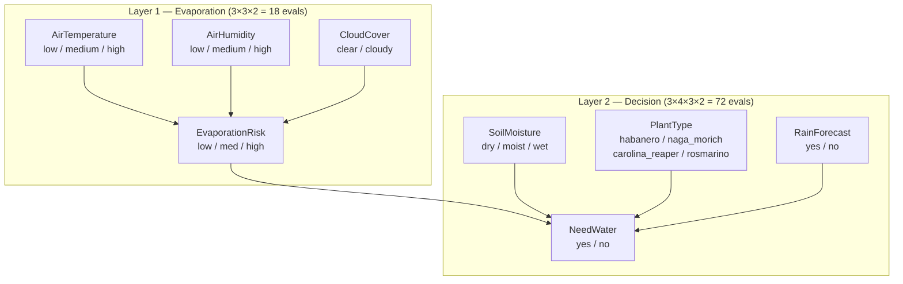

# BayesianSprinkler

Autonomous irrigation controller powered by a Bayesian network. Fuses on-device sensor readings from an ESP32 with internet weather data to decide per-plant whether to water.

## Architecture

A single Bayesian network serves all plants. An intermediate `EvaporationRisk` node decouples the environmental layer from the decision layer, keeping the CPTs compact (18 + 72 entries instead of 648).

### Network structure



### DAG edges

| Edge | Rationale |
|---|---|
| `AirTemperature → EvaporationRisk` | Higher temperature drives evaporation |
| `AirHumidity → EvaporationRisk` | Lower humidity drives evaporation |
| `CloudCover → EvaporationRisk` | Clear skies increase solar radiation and evaporation |
| `EvaporationRisk → NeedWater` | High evaporation means plants lose water faster |
| `SoilMoisture → NeedWater` | Dry soil is the primary signal to irrigate |
| `PlantType → NeedWater` | Each species has different baseline water requirements |
| `RainForecast → NeedWater` | Incoming rain can delay or cancel irrigation |

### System architecture

```mermaid
graph TB
    subgraph "FastAPI Server (:8080)"
        API[POST /api/plants/manual-water]
        SCHED[APScheduler<br/>inference cycle (30 min)]
        BN[Bayesian Network<br/>SmartSprinklerBN]
        DB[(SQLite<br/>sensor_history)]
    end

    subgraph "Clients"
        WEB{{"Web Frontend (React)"}}
        APP{{"Mobile App (Flutter)"}}
    end

    subgraph "ESP32 (:80)"
        ESP_CMD[POST /command]
        ESP_STAT[GET /status<br/>soil, temp, humidity]
    end

    subgraph "External"
        WX[Open-Meteo API<br/>cloud cover, rain forecast]
    end

    WEB -->|configures| ESP_STAT
    WEB -->|configures| API
    APP -->|configures| ESP_STAT
    APP -->|configures| API
    WEB -->|POST /command| ESP_CMD
    APP -->|POST /command| ESP_CMD

    SCHED -->|every 120s| ESP_STAT
    SCHED -->|every 1h| WX
    SCHED --> BN
    SCHED --> DB

    API --> ESP_STAT
    API --> WX
    API --> DB
    API --> ESP_CMD

    DB -->|refine_weights.py<br/>weekly cron| BN
```

> **CORS**: The FastAPI server has `CORSMiddleware(allow_origins=["*"])` enabled so the web frontend (served on a different port) can call it without browser restrictions.

### Node states

| Node | States | Source |
|---|---|---|
| `AirTemperature` | `low` (<15°C), `medium` (15-30°C), `high` (>30°C) | DHT22 via ESP `/status` |
| `AirHumidity` | `low` (<30%), `medium` (30-70%), `high` (>70%) | DHT22 via ESP `/status` |
| `CloudCover` | `clear` (<50%), `cloudy` (≥50%) | Open-Meteo API (`current.cloud_cover`) |
| `SoilMoisture` | `dry` (0-30%), `moist` (30-70%), `wet` (70-100%) | HW-390 via ESP `/status` |
| `PlantType` | `habanero`, `naga_morich`, `carolina_reaper`, `rosmarino` | Configured in `config.yaml` |
| `RainForecast` | `yes` (precip > 0 mm), `no` | Open-Meteo API (`daily.precipitation_sum`) |
| `EvaporationRisk` | `low`, `med`, `high` | Inferred from temperature, humidity, cloud cover |
| `NeedWater` | `yes`, `no` | Inferred — the decision variable |

## CPT generation logic

### EvaporationRisk

A weighted score combines the three parent states, then maps to a distribution:

```
          temp_score × 0.4 + humid_score × 0.4 + cloud_score × 0.2
score  =  ──────────────────────────────────────────────────────────
                                    1.0
```

| Score range | P(low) | P(med) | P(high) |
|---|---|---|---|
| ≤ 0.2 | 0.85 | 0.10 | 0.05 |
| 0.2 – 0.4 | 0.50 | 0.40 | 0.10 |
| 0.4 – 0.6 | 0.10 | 0.70 | 0.20 |
| 0.6 – 0.8 | 0.05 | 0.35 | 0.60 |
| > 0.8 | 0.02 | 0.08 | 0.90 |

### NeedWater

A weighted score combines plant base need, evaporation risk, and soil moisture:

```
score  =  base_need × 0.20 + evap_score × 0.30 + moisture_score × 0.50

if rain_forecast == "yes":
    score ×= 0.85
```

| Input | Weights |
|---|---|
| `base_need` | 0.20 |
| `evap_score` (low=0, med=0.5, high=1) | 0.30 |
| `moisture_score` (dry=1, moist=0.3, wet=0) | 0.50 |
| `RainForecast = "yes"` | × 0.85 |

Soil moisture dominates (50%). Rain is a mild 15% dampener: it tips borderline cases under the threshold but does **not** override a dry-soil/high-evaporation need. The score is clipped to `[0.01, 0.99]` before being emitted as `P(NeedWater=yes)`.

The decision threshold per plant is set in `config.yaml`:

| Plant | `base_need` | `threshold` | Behaviour |
|---|---|---|---|---|
| Habanero | 0.65 | 0.50 | Capsicum chinense, thirsty |
| Naga Morich | 0.68 | 0.50 | Capsicum chinense super-hot, thirsty |
| Carolina Reaper | 0.70 | 0.48 | Most water-sensitive, lowest threshold |
| Rosmarino | 0.20 | 0.80 | Drought-tolerant, waters sparingly |

## Usage

### Start the server

```bash
uv sync
uv run bayesian-sprinkler
```

Starts a FastAPI server (default `http://0.0.0.0:8080`) with:

| Endpoint | Method | Purpose |
|---|---|---|
| `/api/health` | GET | Health check |
| `/api/dashboard` | GET | Combined ESP telemetry + per-plant need + weather in one request |
| `/api/plants/status` | GET | Returns per-plant `probability_of_need` (0–1 scale) + evidence breakdown; uses each plant's own `sensor_index` soil reading |
| `/api/weather/status` | GET | Returns cached weather data from Open-Meteo (cloud cover, rain forecast, temperature, humidity) |
| `/api/esp/status` | GET | Most recent ESP `/status` snapshot the server has captured (no extra polling — apps should call this instead of hitting the ESP) |
| `/api/plants/manual-water` | POST | Log a human-triggered watering event (`need_water=yes`); then triggers ESP via `POST /command` |
| `/api/cistern` | GET | Current cistern level estimate (`level_ml`, `capacity_ml`, `level_pct`, `water_low_alert`) |
| `/api/cistern/refill` | POST | Force the cistern estimate back to full — mirrors the automatic on→off transition of the `water_low_alert` sensor |
| `/api/audit-log` | GET | Audit log entries (newest first), filterable by `filter` / `category`, with `limit` |
| `/api/audit-log` | DELETE | Clear all audit log entries |
| `/api/audit-log/export` | GET | Download the audit log as CSV |

### Background jobs (APScheduler)

| Job | Interval | What it does |
|---|---|---|
| **Inference cycle** | `poll_interval` (default 1800 s) | Reads ESP sensors + weather, logs every plant's BN decision (`need_water=yes/no`) to SQLite, waters if `P(need water) > threshold` |

Dry-day telemetry stays consistent because the plant loop also logs to SQLite during the inference cycle itself.

### Sensor routing & error handling

- Each plant is mapped to a soil sensor via `sensor_index` in `config.yaml`; the per-plant soil reading feeds the BN evidence.
- The server **never fabricates sensor/weather values**. If the ESP is offline or a reading is invalid, an `error` audit entry (with traceback) is logged and the cycle is skipped — no misleading rows.

## Data & refinement pipeline

### Database

Sensor history is stored in `data/sprinkler.db` (SQLite, WAL mode):

```sql
sensor_history (id, timestamp, plant_type, soil_moisture,
                air_temperature, air_humidity, cloud_cover,
                rain_forecast, need_water)

audit_log (id, timestamp, category, message, details)
```

The `audit_log` table records every inference, ESP command, water-level alert, and error (with traceback) so failures are greppable and exportable via `/api/audit-log/export`.

### Refinement script

```bash
uv run python -m bayesian_sprinkler.refine_weights
# or weekly via cron:
# 0 3 * * 0 cd /path/to/BayesianSprinkler && uv run python -m bayesian_sprinkler.refine_weights
```

Uses Bayesian parameter estimation to blend the expert CPT with empirical data:

```
posterior  =  (expert_CPT × prior_strength  +  empirical_counts)
             ─────────────────────────────────────────────────
                  prior_strength  +  total_observations
```

- `prior_strength` (default 50) controls how much weight the expert prior keeps. Lower values = data dominates faster.
- Output: `data/refined_model.pkl` (pickled `DiscreteBayesianNetwork`)

### Manual watering (web + mobile integration)

When the user triggers watering via the web frontend (Control tab) or Flutter app, the routing mode determines the path:

- **Via Bayesian (toggle ON)**: Sends `POST /api/plants/manual-water` → server logs event with `need_water=yes`, then sends `POST /command` to ESP
- **Direct ESP (toggle OFF)**: Client sends `POST /command` directly to ESP (bypasses Bayesian server — used when server is offline)

The web frontend's Control tab exposes this choice explicitly via the **Direct ESP / Via Bayesian** toggle. Configure URLs in the **Settings** tab (persisted to `localStorage`).

## Cistern level tracking

The server maintains an estimate of the water tank (`cistern_capacity_ml` in `config.yaml`, default 30000 mL) and exposes it via `GET /api/cistern`. When the ESP's `water_low_alert` sensor transitions:

- **on → off** (tank refilled): the estimate is automatically reset to full.
- **off → on** (tank empty): the alert is stored and manual watering is blocked unless `force=true`.

`POST /api/cistern/refill` forces the estimate back to full for ops/testing without physically refilling; it also logs the action to the audit log.

## Requirements

- Python ≥ 3.10
- ESP32 running the [SmartSprinkler firmware](../firmware) with reachable HTTP API
- Sensors: HW-390 (soil moisture), DHT22 (temp/humidity)
- Internet access (for Open-Meteo weather API)

## Web Frontend

A React-based web dashboard is provided in [`./web_frontend`](./web_frontend/README.md) for browser-based monitoring and control.

### Running

```bash
cd web_frontend
npm install
npm run dev     # development server at http://localhost:3000
npm run build   # production build
```

Or via Docker (from the project root):

```bash
docker compose up web-frontend
# → http://localhost:3000
```

### Features

| Tab | Description |
|---|---|
| **Dashboard** | Real-time ESP telemetry (temp, humidity, soil moisture, pump status), cistern level widget, weather context from Open-Meteo, per-plant Bayesian need probabilities |
| **Control** | Plant selector, Direct ESP / Via Bayesian routing toggle, Start/Stop buttons, dispense amount (ml) presets |
| **Simulation** | Interactive simulation of the inference cycle over configurable weather/soil scenarios |
| **Camera** | ESP32-CAM live video stream |
| **Logs** | Audit log with error-count banner, "view errors" filter, and expandable detail rows (tracebacks) |
| **Settings** | ESP32 URL, Bayesian Server URL, polling interval — persisted to browser `localStorage` |

### CORS

The Bayesian server has `CORSMiddleware(allow_origins=["*"])` enabled so the web frontend can call its API from any browser origin. The ESP32 firmware must also permit cross-origin requests (Mongoose HTTP server allows this by default for simple requests).
