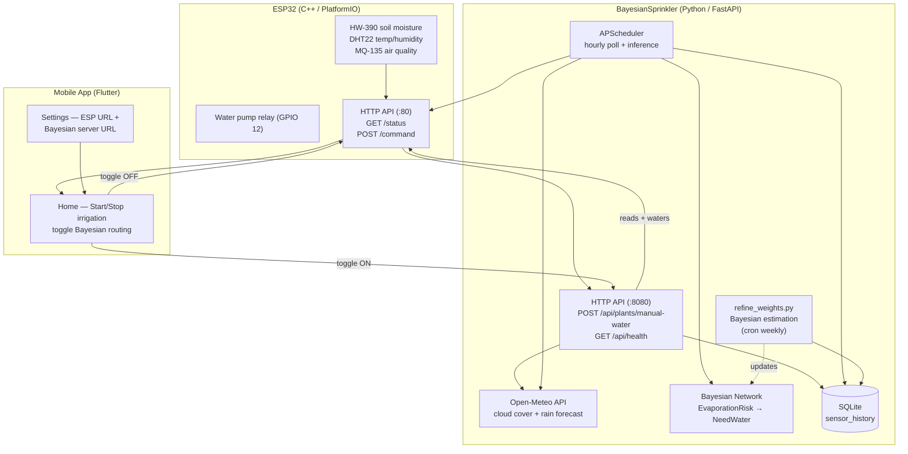

# SmartSprinkler

Autonomous irrigation system with Bayesian decision-making, ESP32 relay control, and a mobile app for manual override.

## Architecture



## Components

### [`firmware/`](firmware) — ESP32 controller

PlatformIO project running on an ESP32-CAM. Exposes two HTTP servers:

- **Smart Sprinkler API** (Mongoose, port 80):
  - `GET /status` — returns `air_temperature`, `air_humidity`, `soil_moisture`, `water_pump`
  - `POST /command` — accepts `{"action": "START|STOP|DISPENSE_SPECIFIC_AMOUNT", "target": "PLANT_NAME", "amount": <ml>}` and toggles the pump relay on GPIO 12

### [`smartsprinkler_app/`](smartsprinkler_app) — Flutter mobile app

ViewModel-based app that polls `GET /status` every 2s and lets the user:

- Select a plant from a dropdown
- Start/Stop irrigation via `POST /command` directly to the ESP, **or** route through the Bayesian server (toggle switch)
- Configure both the ESP URL and the Bayesian server URL in Settings

### [`BayesianSprinkler/`](BayesianSprinkler) — Python Bayesian server

FastAPI server that runs the autonomous decision loop:

- **Bayesian network** with 8 nodes (`AirTemperature`, `AirHumidity`, `CloudCover` → `EvaporationRisk` → `NeedWater` + `SoilMoisture`, `PlantType`, `RainForecast`). Intermediate `EvaporationRisk` node keeps CPTs compact (18 + 72 entries).
- **APScheduler** runs two background jobs:
  - *Hourly poll* — reads sensors + weather, logs baseline (`need_water=no`) to SQLite
  - *Inference cycle* — queries the BN every `poll_interval` seconds and waters plants that exceed their probability threshold
- **`POST /api/plants/manual-water`** — on-demand endpoint called by the mobile app: snapshots current conditions with `need_water=yes`, then triggers the ESP relay
- **`refine_weights.py`** — Bayesian parameter estimation with Dirichlet prior, blends expert CPTs with collected data to refine the model over time

## Data flow

```
                    ┌──────────────────────┐
                    │   Mobile App          │
                    │  (manual override)    │
                    └──┬───────────────┬────┘
                       │ toggle OFF    │ toggle ON
                       ▼               ▼
              ┌────────────────┐  ┌──────────────────┐
              │  ESP32 (:80)   │  │ BayesianSprinkler │
              │  GET /status   │  │  (:8080)          │
              │  POST /command │  │  POST /manual-    │
              └────────────────┘  │  water            │
                       ▲          └────────┬─────────┘
                       │                   │
                       │            ┌──────▼──────┐
                       │            │  Open-Meteo  │
                       │            │  (weather)   │
                       │            └─────────────┘
                       │
              ┌────────┴────────┐
              │  SQLite          │
              │  sensor_history  │
              └────────┬────────┘
                       │
              ┌────────▼────────┐
              │  refine_weights │──► updated BN CPTs
              │  (cron weekly)  │
              └─────────────────┘
```

## Quick start

```bash
# Bayesian server
cd BayesianSprinkler
uv sync
uv run bayesian-sprinkler

# Mobile app
cd smartsprinkler_app
flutter run

# Firmware (requires PlatformIO)
cd firmware
pio run --target upload
```

See each component's README for detailed setup instructions.
