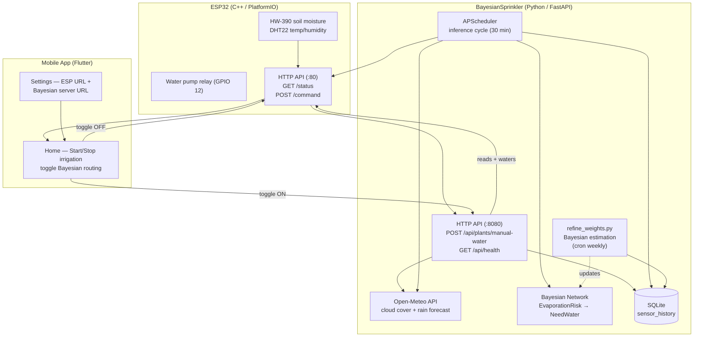

# SmartSprinkler

Autonomous irrigation system with Bayesian decision-making, ESP32 relay control, and a mobile app for manual override.

## Architecture



## Components

### [`firmware/`](firmware) — ESP32 controller

PlatformIO project running on an ESP32-CAM. Exposes two HTTP servers:

- **Smart Sprinkler API** (Mongoose, port 80):
  - `GET /status` — returns `air_temperature`, `air_humidity`, `soil_moisture`, `water_pump`
  - `POST /command` — accepts `{"action": "START|STOP|DISPENSE_SPECIFIC_AMOUNT", "target": "PLANT_NAME", "amount": <ml>}` and toggles the pump relay on GPIO 12
  - `GET /health` — `{"status":"ok", "version":"<FW_VERSION>"}` (auto-incremented per build)
  - `POST /update` — OTA firmware upload (`multipart/form-data`, `update=firmware.bin`)

### [`smartsprinkler_app/`](smartsprinkler_app) — Flutter mobile app

ViewModel-based app with 4 tabs (Dashboard, Camera, Logs, System). It polls the Bayesian server's `/api/dashboard` (the ESP's latest captured snapshot, no direct ESP polling) and lets the user:

- Select a plant from a dropdown
- Start/Stop irrigation via `POST /command` directly to the ESP, **or** route through the Bayesian server (toggle switch)
- Monitor the cistern level, view the audit log (with errors), watch the live ESP camera, and receive water-low notifications
- Configure internal (LAN) and external URL pairs per service in Settings — the app auto-switches based on the active Wi-Fi SSID

### [`BayesianSprinkler/`](BayesianSprinkler) — Python Bayesian server

FastAPI server that runs the autonomous decision loop:

- **Bayesian network** with 8 nodes (`AirTemperature`, `AirHumidity`, `CloudCover` → `EvaporationRisk` → `NeedWater` + `SoilMoisture`, `PlantType`, `RainForecast`). Intermediate `EvaporationRisk` node keeps CPTs compact (18 + 72 entries).
- **APScheduler** runs a single background job every `poll_interval` seconds (30 min by default):
  - *Inference cycle* — reads the ESP sensors, fetches weather, logs every plant's BN decision (`need_water=yes/no` per plant) to SQLite, then waters plants that exceed their probability threshold
- **`POST /api/plants/manual-water`** — on-demand endpoint called by the mobile app: snapshots current conditions with `need_water=yes`, then triggers the ESP relay
- **Cistern tracking** — the server tracks the water tank level (`/api/cistern`), deduces refills from the ESP `water_low_alert` sensor, and provides `POST /api/cistern/refill` for manual override
- **Audit log** — every inference, command, and error is logged with a traceback (`/api/audit-log`, `GET`/`DELETE`/CSV export); errors are surfaced in the web UI instead of silently swallowed
- **OTA relay** — `POST /api/esp/ota` streams a firmware `.bin` upload on to the ESP's `/update` (with audit logging), and `GET /api/esp/version` relays the installed firmware version read from the ESP `/health` endpoint
- **`refine_weights.py`** — Bayesian parameter estimation with Dirichlet prior, blends expert CPTs with collected data to refine the model over time

## Data flow

```
                    ┌──────────────────────┐
                    │   Mobile App          │
                    │  (manual override)    │
                    └──┬───────────────┬────┘
                       │ toggle OFF    │ toggle ON
                       ▼               ▼
              ┌────────────────┐  ┌──────────────────┐
              │  ESP32 (:80)   │  │ BayesianSprinkler │
              │  GET /status   │  │  (:8080)          │
              │  POST /command │  │  POST /manual-    │
              └────────────────┘  │  water            │
                       ▲          └────────┬─────────┘
                       │                   │
                       │            ┌──────▼──────┐
                       │            │  Open-Meteo  │
                       │            │  (weather)   │
                       │            └─────────────┘
                       │
              ┌────────┴────────┐
              │  SQLite          │
              │  sensor_history  │
              └────────┬────────┘
                       │
              ┌────────▼────────┐
              │  refine_weights │──► updated BN CPTs
              │  (cron weekly)  │
              └─────────────────┘
```

## Testing

```bash
cd BayesianSprinkler
uv sync
uv run pytest          # full suite: BN, API, ESP integration, firmware API contract
```

The firmware API contract tests (`tests/test_firmware_api_contract.py`) emulate Mongoose's chunked HTTP send against the exact `/status`, `/health`, and `/command` schemas, so the server client fails loudly if the ESP ever regresses to a truncated/invalid JSON body.

## Quick start

```bash
# Bayesian server
cd BayesianSprinkler
uv sync
uv run bayesian-sprinkler

# Mobile app
cd smartsprinkler_app
flutter run

# Firmware (requires PlatformIO)
cd firmware
pio run --target upload
```

See each component's README for detailed setup instructions.
