# SmartSprinkler — Firmware

PlatformIO project for the ESP32-CAM (main controller) and Arduino Nano (sensor slave). The ESP32 controls irrigation, routes water via a rotary selector (SG90 servo), and exposes sensor readings via HTTP. The Arduino Nano reads 4 soil moisture sensors, a DHT22 temperature/humidity sensor, and a water level float switch, then streams all data to the ESP32 over a software serial link.

## Hardware


### Pinout

**ESP32-CAM (main controller)**

| Component          | GPIO       | Notes                                      |
|-------------------|------------|--------------------------------------------|
| Camera (AI-Thinker) | 0, 5, 18, 19, 21, 22, 23, 25, 26, 27, 32, 34, 35, 36, 39 | ESP32-CAM fixed pinout |
| Water pump relay   | 12         | Active HIGH                                |
| SG90 rotary servo  | 13         | PWM signal (50Hz, 500–2500 µs pulse width)|
| Nano UART RX       | 14         | SoftwareSerial level-shifted 5V→3.3V       |
| Nano UART TX       | 15         | Direct connection (3.3V → Nano RX is safe) |

**Arduino Nano (sensor slave)** — `firmware/src/arduino_nano/nano_sensor_reader.cpp`

| Nano pin | Direction | Connection                                         |
|----------|-----------|----------------------------------------------------|
| A0–A3    | Input     | HW-390 OUT ×4 (Habanero, Naga, Carolina, Rosmarino)|
| D2       | Input     | DHT22 DATA                                        |
| D3       | TX        | ESP32 GPIO 14 (via 1kΩ+2kΩ voltage divider)       |
| D4       | RX        | ESP32 GPIO 15 (direct)                            |
| D5       | Input     | Float switch (water level) — pull-up internal      |
| VIN      | Power in  | ESP32 5V rail                                     |
| GND      | Ground    | ESP32 GND (shared ground is mandatory)             |

### Wiring Diagram

```mermaid
graph TB
    subgraph ESP32["🟡 ESP32-CAM (Main Controller)"]
        GPIO12["🔌 GPIO 12<br>Pump Relay IN"]
        GPIO13["🔌 GPIO 13<br>Servo PWM"]
        GPIO14["🔌 GPIO 14<br>Nano UART RX<br><small>(via divider)</small>"]
        GPIO15["🔌 GPIO 15<br>Nano UART TX"]
        5V["🔌 5V rail"]
        GND["🔌 GND"]
    end

    subgraph Nano["🔵 Arduino Nano (Sensor Slave)"]
        A0["🔌 A0<br>HW-390 #1<br>Habanero"]
        A1["🔌 A1<br>HW-390 #2<br>Naga Morich"]
        A2["🔌 A2<br>HW-390 #3<br>Carolina Reaper"]
        A3["🔌 A3<br>HW-390 #4<br>Rosmarino"]
        D2["🔌 D2<br>DHT22 DATA"]
        D3["🔌 D3<br>UART TX → ESP GPIO14"]
        D4["🔌 D4<br>UART RX ← ESP GPIO15"]
        D5["🔌 D5<br>Float Switch (NC)"]
        VIN_N["🔌 VIN<br>← ESP 5V"]
        GND_N["🔌 GND"]
    end

    subgraph Required["✅ Required Components"]
        DHT22["🌡️ DHT22<br>Temp + Humidity<br><small>┬ VCC (1) → Nano VIN<br>├ DATA (2) → Nano D2<br>├ NC (3)<br>└ GND (4) → Nano GND</small>"]
        PUMP_RELAY["⚡ Pump Relay Module<br>(Active HIGH)<br><small>┬ VCC (1)<br>├ IN (2) → GPIO12<br>├ GND (3)<br>└ NO/COM (pump)</small>"]
        SERVO["🔄 SG90 Servo<br>Rotary Selector<br><small>┬ VCC (1) → 5V<br>├ GND (2) → GND<br>└ PWM (3) → GPIO13</small>"]
        FLOAT["🔔 Float Switch (NC)<br>Water Level<br><small>┬ VCC (1) → Nano VIN<br>├ GND (2) → Nano GND<br>└ SIG (3) → Nano D5</small>"]
    end

    subgraph SoilSensors["🌱 Soil Moisture Sensors (×4)"]
        SM1["💧 HW-390 #1<br>Habanero"]
        SM2["💧 HW-390 #2<br>Naga Morich"]
        SM3["💧 HW-390 #3<br>Carolina Reaper"]
        SM4["💧 HW-390 #4<br>Rosmarino"]
    end

    GPIO12 ==> PUMP_RELAY
    GPIO13 ==> SERVO
    GPIO14 ==>|"RX via divider"| D3
    GPIO15 ==>|"TX"| D4
    5V ==>|"5V"| PUMP_RELAY
    5V ==>|"5V"| SERVO
    5V ==>|"5V"| VIN_N
    GND ==>|"GND"| PUMP_RELAY
    GND ==>|"GND"| SERVO
    GND ==>|"GND"| GND_N
    5V ==>|"5V"| DHT22
    GND ==>|"GND"| DHT22
    5V ==>|"5V"| FLOAT
    GND ==>|"GND"| FLOAT
    5V ==>|"5V"| SM1
    5V ==>|"5V"| SM2
    5V ==>|"5V"| SM3
    5V ==>|"5V"| SM4
    GND ==>|"GND"| SM1
    GND ==>|"GND"| SM2
    GND ==>|"GND"| SM3
    GND ==>|"GND"| SM4
    SM1 ==>|"OUT"| A0
    SM2 ==>|"OUT"| A1
    SM3 ==>|"OUT"| A2
    SM4 ==>|"OUT"| A3

    classDef esp32 fill:#FFF9C4,stroke:#F9A825
    classDef nano fill:#E3F2FD,stroke:#1565C0
    classDef required fill:#E8F5E9,stroke:#2E7D32
    classDef sensor fill:#E3F2FD,stroke:#1565C0
    classDef gpio fill:#FCE4EC,stroke:#AD1457
    classDef pwr fill:#FFEBEE,stroke:#C62828
    classDef gnd fill:#ECEFF1,stroke:#607D8B

    class GPIO12,GPIO13,GPIO14,GPIO15,5V,GND esp32
    class A0,A1,A2,A3,D2,D3,D4,D5,VIN_N,GND_N nano
    class DHT22,PUMP_RELAY,SERVO,FLOAT required
    class SM1,SM2,SM3,SM4 sensor
```



**Legend:**
- `==>` = required power + signal connection
- Pin numbers shown in `<small>` as `┬ ├ └` tree (component top = pin 1)

### Rotary Selector — Plant Mapping

The SG90 servo rotates a 3D-printed water path selector (Instructables: *Water Path Selector*) to direct water from a single input to one of 4 output ports. Each output connects to a different plant's drip line.

The servo position (angle) selects the active output (based on 3D-printed Water Path Selector from Instructables):

| Plant            | Position | Angle (18° step) |
|------------------|----------|-------------------|
| Habanero        | 0        | 52°              |
| Naga Morich     | 1        | 70°              |
| Carolina Reaper | 2        | 88°              |
| Rosmarino       | 3        | 106°             |

The step angle (`ROTARY_DELTA_DEG = 18.0°`, start `ROTARY_START_DEG = 52.0°`) can be adjusted in `src/esp32/main.cpp` once the physical positioning is calibrated. After moving to a position, the servo holds that position indefinitely (no power draw after reaching target).

### Startup Calibration

On boot, the firmware runs a calibration sweep: it visits each position sequentially, waits 800 ms, reads back the actual pulse width, and verifies the servo reached the target within ±100 µs tolerance. If any position fails, `rotary_position` in `/status` reports `"uncalibrated"` and the system falls back to software-only position tracking. Adjust `ROTARY_DELTA_DEG` if the servo doesn't reach all positions accurately.

## Arduino Nano — Sensor Slave

The ESP32-CAM has no free ADC1 pins (all exposed GPIOs are ADC2, which conflicts with WiFi), so an **Arduino Nano** reads the 4 soil moisture sensors, the DHT22 temperature/humidity sensor, and the water level float switch, then streams everything over a 9600 baud software serial link.

#### Serial Protocol

The Nano sends one line every 500 ms:

```
S:412#380#501#290#23.5#65.2#1\n
```

Format: `S:soil0#soil1#soil2#soil3#temp#humidity#water_ok`

| Field       | Description                                    |
|-------------|------------------------------------------------|
| `soil0–3`  | Raw ADC readings (0–1023) for sensors #1–#4   |
| `temp`      | Temperature in °C (DHT22)                     |
| `humidity`  | Relative humidity % (DHT22)                   |
| `water_ok`  | 1 = water OK, 0 = tank empty (float NC trigger)|

#### Wiring

**Power** (single USB-C to ESP32-CAM, then distributed):
```
ESP32 5V pin → Nano VIN, HW-390 #1 VCC, #2 VCC, #3 VCC, #4 VCC, DHT22 VCC, Float Switch VCC
ESP32 GND    → Nano GND, HW-390 #1 GND, #2 GND, #3 GND, #4 GND, DHT22 GND, Float Switch GND
```

**Serial** (Nano D3/D4 ↔ ESP32 GPIO 14/15):
```
Nano D3 (TX, 5V) ──[1kΩ]──┬── ESP32 GPIO 14 (RX, 3.3V)
                            [2kΩ]
                             │
                            GND

ESP32 GPIO 15 (TX, 3.3V) ──── Nano D4 (RX)    [direct, 3.3V safe for 5V Nano]
```

The voltage divider drops the Nano's 5V TX down to 3.3V to protect the ESP32 RX pin. The reverse direction (ESP32 TX → Nano RX) is safe without level shifting because the Nano reads 3.3V as HIGH.

**Sensors** (HW-390 analog output → Nano ADC):
```
HW-390 #1 OUT → Nano A0   (Habanero)
HW-390 #2 OUT → Nano A1   (Naga Morich)
HW-390 #3 OUT → Nano A2   (Carolina Reaper)
HW-390 #4 OUT → Nano A3   (Rosmarino)
```

**DHT22** (Temperature + Humidity → Nano):
```
DHT22 VCC   → Nano VIN
DHT22 DATA  → Nano D2
DHT22 GND   → Nano GND
```

**Float Switch** (Water Level → Nano):
```
Float Switch VCC → Nano VIN
Float Switch GND → Nano GND
Float Switch SIG → Nano D5 (internal pull-up enabled: LOW = water OK, HIGH = empty)
```

**Important:** shared GND between ESP32 and Nano is **mandatory** — without it, the serial voltage levels have no reference and communication will fail.

#### Calibration

After the first boot, read the raw ADC values from the ESP32 serial monitor (look for `SM=[...]` in the logs) and adjust `SOIL_DRY_ADC` in `src/esp32/main.cpp` to match the value reported by a fully dry sensor.

## API endpoints (Mongoose, port 80)

### `GET /status`

Returns current sensor readings, rotary selector position, and active plant:

```json
{
    "status": "ok",
    "air_temperature": "23.50",
    "air_humidity": "65.20",
    "soil_moisture": "42.00",
    "soil_moisture_0": "412",
    "soil_moisture_1": "380",
    "soil_moisture_2": "501",
    "soil_moisture_3": "290",
    "water_pump": "off",
    "rotary_position": "1",
    "water_low_alert": "off",
    "blocked_amount_ml": "0",
    "active_plant": "null",
    "camera_url": "192.168.1.10:81/stream"
}
```

`rotary_position` is `0`–`3` (calibrated) or `"uncalibrated"` (calibration failed).
`active_plant` contains the target name (e.g. `"NAGA_MORICH"`) when the pump is running, `"null"` when idle.
`water_low_alert` is `"on"` when the float switch triggers (tank empty), `"off"` when water is OK.

### `POST /command`

```json
{"action": "START", "target": "NAGA_MORICH"}
{"action": "STOP",  "target": "NAGA_MORICH"}
{"action": "DISPENSE_SPECIFIC_AMOUNT", "target": "HABANERO", "amount": 500}
{"action": "START", "target": "ROSMARINO", "force": true}
```

| Field  | Values                                              |
|--------|-----------------------------------------------------|
| `action`  | `START`, `STOP`, `DISPENSE_SPECIFIC_AMOUNT`  |
| `target`   | `NAGA_MORICH`, `ROSMARINO`, `HABANERO`, `CAROLINA_REAPER` |
| `amount`   | ml (only for `DISPENSE_SPECIFIC_AMOUNT`)      |
| `force`    | `true` to bypass water-low alert (optional, default `false`) |

`DISPENSE_SPECIFIC_AMOUNT` moves the servo to the selected plant's position, turns on the pump, waits `amount / FLOW_RATE_ML_PER_MIN * 60` seconds, then stops the pump (servo stays at last position).

`START` moves the servo and turns on the pump continuously. Use `STOP` to shut off.

### `GET /health`

Returns `{"status":"ok"}`.

## Targets (`Target` enum)

Defined in `src/model/command.h`:

```cpp
enum Target { NAGA_MORICH=0, ROSMARINO=1, HABANERO=2, CAROLINA_REAPER=3 };
```

## Water Level Alert

When the float switch triggers (NC opens = tank empty), `water_low_alert` becomes `"on"`. The ESP blocks `START` and `DISPENSE_SPECIFIC_AMOUNT` commands unless `force: true` is set. The `blocked_amount_ml` field in `/status` records how many ml were denied in the last blocked attempt.

The Bayesian server also sends an email alert when the water level drops and logs the event.

## Flow Rate Calibration

The default `FLOW_RATE_ML_PER_MIN` is 6000 (6 L/min). To calibrate:

1. Run `DISPENSE_SPECIFIC_AMOUNT` with a known amount (e.g. 1000 ml)
2. Measure actual dispensed water with a graduated cylinder
3. Adjust in `src/esp32/main.cpp`:
   ```cpp
   #define FLOW_RATE_ML_PER_MIN <your_value>
   ```

## Build & deploy

**ESP32-CAM (main controller):**
```bash
pio run --target upload -e esp32
pio device monitor -e esp32  # serial console at 115200 baud
```

**Arduino Nano (sensor slave):**
```bash
pio run --target upload -e nano
pio device monitor -e nano  # serial console at 9600 baud (debug only — D3/D4 used for ESP)
```

## WiFi configuration

WiFi credentials can be provided through a local, gitignored file and (optionally) an encrypted NVS setting on the device.

### Local file (recommended)

1. Copy the template:
   ```bash
   cp firmware/include/wifi_secrets.h.example firmware/include/wifi_secrets.h
   ```
2. Edit it with your credentials:
   ```cpp
   #define WIFI_SSID_LOCAL "MyWiFi"
   #define WIFI_PASSWORD_LOCAL "MyPassword"
   ```
3. `firmware/include/wifi_secrets.h` is ignored via `.gitignore`, so it will never be pushed. Build normally:
   ```bash
   pio run -e esp32
   ```

If the file is missing, the build still succeeds and the defaults are empty strings — the device will not connect to WiFi until credentials are provided.

### Overriding on the device (NVS)

The firmware stores WiFi credentials in NVS flash memory. On first boot it seeds NVS from the local file above. You can override them at runtime over the USB serial console:

```
WIFI MyWiFi MyPassword
```

The new credentials are persisted to NVS and the ESP reconnects immediately. NVS values always take precedence over the local file.

## Unused / Spare Components

- **74HC4051 (×3)** — 8-channel analog muxes. Not needed; the Arduino Nano provides 4 dedicated ADC channels.
- **AMS1117 (×4 remaining)** — 5→3.3V regulators. Now unused since the Nano reads sensors directly from its 5V rail.
- **GPIO 2** — freed up (was DHT22 DATA). Available for future use.
- **GPIO 4** — freed up (was ADS1115 SCL). Available for future use.
- **GPIO 16** — free, previously used for valve relays 2 and 3.

WiFi credentials are configured via the gitignored local file `firmware/include/wifi_secrets.h` — see [WiFi configuration](#wifi-configuration).
