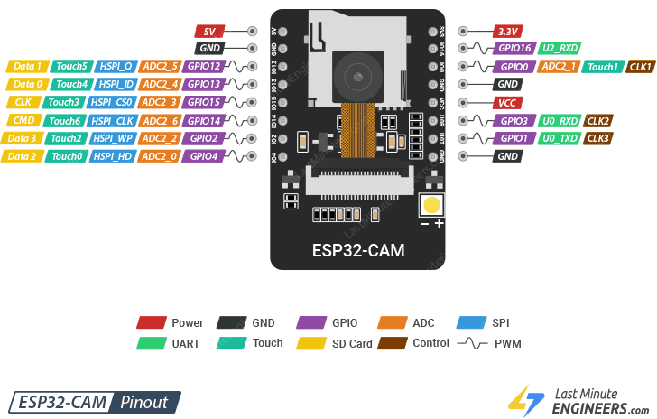
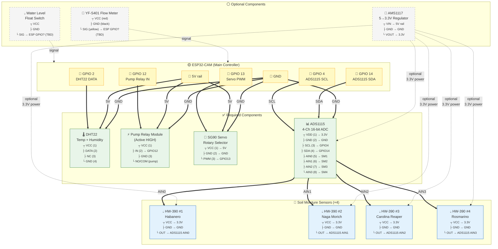

# SmartSprinkler — Firmware

PlatformIO project for the ESP32-CAM board that controls the irrigation pump, routes water via a rotary selector (SG90 servo) to 4 plants, and exposes sensor readings via HTTP.

## Hardware


### Pinout

| Component             | GPIO       | Notes                                              |
|-----------------------|------------|----------------------------------------------------|
| Camera (AI-Thinker)   | 0, 5, 18, 19, 21, 22, 23, 25, 26, 27, 32, 34, 35, 36, 39 | ESP32-CAM fixed pinout  |
| DHT22 (temp/humidity) | 2          |                                                    |
| Water pump relay      | 12         | Active HIGH                                        |
| SG90 rotary servo     | 13         | PWM signal (50Hz, 500–2500 µs pulse width)        |
| ADS1115 SCL          | 4          | Software I2C (camera LED repurposed)                |
| ADS1115 SDA          | 14         | Software I2C                                       |

> **GPIO 15 and 16 are free** — previously used for valve relays 2 and 3.

### Wiring Diagram



**Legend:**
- `==>` = required power + signal connection
- `-.->` = optional connection (not yet implemented in firmware)
- Pin numbers shown in `<small>` as `┬ ├ └` tree (component top = pin 1)

### Rotary Selector — Plant Mapping

The SG90 servo rotates a 3D-printed water path selector (Instructables: *Water Path Selector*) to direct water from a single input to one of 4 output ports. Each output connects to a different plant's drip line.

The servo position (angle) selects the active output (based on 3D-printed Water Path Selector from Instructables):

| Plant            | Position | Angle (18° step) |
|------------------|----------|-------------------|
| Habanero        | 0        | 52°              |
| Naga Morich     | 1        | 70°              |
| Carolina Reaper | 2        | 88°              |
| Rosmarino       | 3        | 106°             |

The step angle (`ROTARY_DELTA_DEG = 18.0°`, start `ROTARY_START_DEG = 52.0°`) can be adjusted in `src/esp32/main.cpp` once the physical positioning is calibrated. After moving to a position, the servo holds that position indefinitely (no power draw after reaching target).

### Startup Calibration

On boot, the firmware runs a calibration sweep: it visits each position sequentially, waits 800 ms, reads back the actual pulse width, and verifies the servo reached the target within ±100 µs tolerance. If any position fails, `rotary_position` in `/status` reports `"uncalibrated"` and the system falls back to software-only position tracking. Adjust `ROTARY_DELTA_DEG` if the servo doesn't reach all positions accurately.

## ADS1115 — 4-Channel 16-bit Soil Moisture ADC

The ESP32-CAM has no free GPIOs for extra ADCs and its ADC2 conflicts with WiFi.
An external ADS1115 (I2C, 4-channel, 16-bit) provides clean isolated readings via software I2C on GPIO 14 (SDA) and GPIO 4 (SCL, camera LED repurposed).

#### Wiring

| ADS1115 | ESP32-CAM     | Sensor             |
|---------|---------------|--------------------|
| VDD     | 3.3V         |                    |
| GND     | GND           |                    |
| SCL     | GPIO 4        | Camera LED flash repurposed as I2C clock |
| SDA     | GPIO 14       |                    |
| AIN0    |               | HW-390 #1 (Habanero)       |
| AIN1    |               | HW-390 #2 (Naga Morich)    |
| AIN2    |               | HW-390 #3 (Carolina Reaper) |
| AIN3    |               | HW-390 #4 (Rosmarino)      |

GPIO 14 is used as digital I2C data (not analog), so the ADC2 WiFi conflict does not apply.
GPIO 4 (camera LED flash) is sacrificed because no free GPIOs remain on the ESP32-CAM.

#### Optional: AMS1117 for clean 3.3V power

For the lowest noise on ADC readings, power the ADS1115 and HW-390 sensors from an external AMS1117 5→3.3V regulator:

```
5V rail → AMS1117 VIN → 3.3V → ADS1115 VDD + HW-390 VCC
```

## API endpoints (Mongoose, port 80)

### `GET /status`

Returns current sensor readings, rotary selector position, and active plant:

```json
{
    "status": "ok",
    "air_temperature": "25.30",
    "air_humidity": "60.50",
    "soil_moisture": "42.00",
    "soil_moisture_0": "412",
    "soil_moisture_1": "380",
    "soil_moisture_2": "501",
    "soil_moisture_3": "290",
    "water_pump": "off",
    "rotary_position": "1",
    "water_low_alert": "off",
    "blocked_amount_ml": "0",
    "active_plant": "null"
}
```

`rotary_position` is `0`–`3` (calibrated) or `"uncalibrated"` (calibration failed).
`active_plant` contains the target name (e.g. `"NAGA_MORICH"`) when the pump is running, `"null"` when idle.

### `POST /command`

```json
{"action": "START", "target": "NAGA_MORICH"}
{"action": "STOP",  "target": "NAGA_MORICH"}
{"action": "DISPENSE_SPECIFIC_AMOUNT", "target": "HABANERO", "amount": 500}
{"action": "START", "target": "ROSMARINO", "force": true}
```

| Field  | Values                                              |
|--------|-----------------------------------------------------|
| `action`  | `START`, `STOP`, `DISPENSE_SPECIFIC_AMOUNT`  |
| `target`   | `NAGA_MORICH`, `ROSMARINO`, `HABANERO`, `CAROLINA_REAPER` |
| `amount`   | ml (only for `DISPENSE_SPECIFIC_AMOUNT`)      |
| `force`    | `true` to bypass water-low alert (optional, default `false`) |

`DISPENSE_SPECIFIC_AMOUNT` moves the servo to the selected plant's position, turns on the pump, waits `amount / FLOW_RATE_ML_PER_MIN * 60` seconds, then stops the pump (servo stays at last position).

`START` moves the servo and turns on the pump continuously. Use `STOP` to shut off.

### `GET /health`

Returns `{"status":"ok"}`.

## Targets (`Target` enum)

Defined in `src/model/command.h`:

```cpp
enum Target { NAGA_MORICH=0, ROSMARINO=1, HABANERO=2, CAROLINA_REAPER=3 };
```

## Water Level Alert

When `water_low_alert` is `true`, the ESP blocks `START` and `DISPENSE_SPECIFIC_AMOUNT` commands unless `force: true` is set. The `blocked_amount_ml` field in `/status` records how many ml were denied in the last blocked attempt.

## Flow Rate Calibration

The default `FLOW_RATE_ML_PER_MIN` is 6000 (6 L/min). To calibrate:

1. Run `DISPENSE_SPECIFIC_AMOUNT` with a known amount (e.g. 1000 ml)
2. Measure actual dispensed water with a graduated cylinder
3. Adjust in `src/esp32/main.cpp`:
   ```cpp
   #define FLOW_RATE_ML_PER_MIN <your_value>
   ```

## Build & deploy

```bash
pio run --target upload -e esp32
pio device monitor  # serial console at 115200 baud
```

## Unused / Spare Components

- **74HC4051 (×3)** — 8-channel analog muxes. Not needed; the ADS1115 provides 4 dedicated ADC channels.
- **AMS1117 (×4 remaining)** — 5→3.3V regulators. One can be used for clean analog power (see above); the rest are spares.
- **GPIO 15, 16** — free, previously used for valve relays 2 and 3.

WiFi credentials are hardcoded in `src/esp32/main.cpp`.
